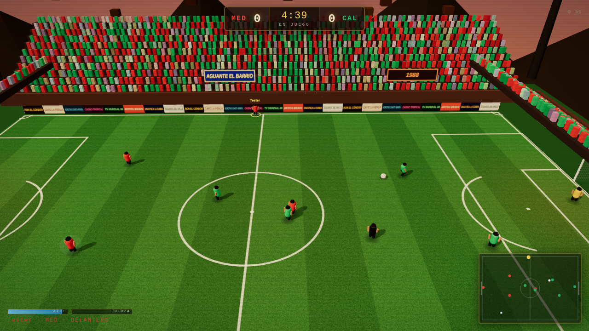

# Narco Futbol

Fast, server-authoritative 3D arcade football for the browser and for Discord.
Five minutes a match, five a side, power-ups, real physics, and bots that fill
every empty shirt so a game never waits for a full lobby.

Everything on screen is built from primitives and canvas textures at runtime -
no models, no images, no audio files.



## Running it

```bash
npm install
npm run dev          # game server on :8080, client with HMR on :5173
```

Open http://localhost:5173. For a production-shaped run:

```bash
npm run build
npm start            # serves the built client and the WebSocket on :8080
```

Other scripts:

| Command | What it does |
| --- | --- |
| `npm test` | Simulation, shooting and protocol tests |
| `npm run typecheck` | Type-checks client, server and shared code |
| `npx tsx scripts/balance.mjs 5 5` | Simulates 5 bot-only matches of 5 minutes and prints goals, shots, tackles, fouls |
| `npx tsx scripts/shots.mjs 5 3` | Classifies where every shot ended up: goal, save, block, wide |
| `SHOT_DIR=/tmp node scripts/smoke.mjs` | Boots the built game in headless Chromium and screenshots it |
| `SHOT_DIR=/tmp node scripts/multiplayer-smoke.mjs` | Two clients, opposite teams, one leaves mid-match |

## Controls

| | |
| --- | --- |
| `WASD` / arrows | Move |
| `Shift` | Sprint |
| `J` / left click | Pass — hold to charge a through ball |
| `K` / right click | Shoot — hold for more power and height |
| `L` | Lofted pass / cross |
| `Space` | Tackle — while sprinting it becomes a sliding tackle |
| `Q` | Switch to the team-mate best placed for the ball |
| `T` chat, `H` controls, `M` mute | |

Gamepad: left stick to move, A pass, B shoot, Y lob, X tackle, RB sprint, LB switch.

You always attack left to right — the camera and the controls both flip for the
away side, so neither team plays in a mirror.

## How it fits together

```
shared/     the simulation and the wire format - identical on both ends
  sim/      ball flight, players, possession, tackles, rules, power-ups
  protocol  binary snapshots and input batches
server/     HTTP + WebSocket host, rooms, bot brains
client/     Three.js renderer, prediction, HUD, procedural audio
```

**The server is the only authority.** There is no host player. Every client
connects to the same dedicated process, sends nothing but its own input, and
receives the world back. Rooms are created on demand by name, so a link with
`?room=barrio` puts a group on their own pitch.

**A single simulation, run in two places.** `stepWorld()` is a pure function
over the world state at a fixed 60 Hz. The server runs it with everyone's
inputs. The client runs the exact same code to predict its own player, so your
movement, dribbling and shooting respond on the frame you press the key.

**Prediction with reconciliation.** Inputs carry a sequence number and are sent
in small redundant batches. Every snapshot acknowledges the last input the
server consumed; the client rewinds to that state, replays the inputs still in
flight, and folds the difference into a decaying offset rather than snapping.
Everyone else is drawn from an interpolation buffer about 110 ms in the past,
which is what makes remote players look smooth. The ball follows the same rule
with one exception: while it is at your feet it comes from the prediction.

**Bandwidth.** Snapshots are quantised to centimetres and packed into about
280 bytes for a 5v5 match, sent 20 times a second - roughly 5.5 KB/s per
client. Lobby traffic and chat stay on JSON text frames.

## Bots and drop-in

Every shirt is always filled. Join and you take over a bot; leave and a bot
takes the shirt straight back, mid-match, without stopping play. Team sizes run
from 2 to 6 a side. The keeper is always automated - nobody wants to spend a
five minute game in goal.

Bots are not frame-perfect on purpose. They re-decide on a reaction timer, aim
with noise, hold buttons the way a human would, press and mark by role, and
only shoot when they have a sight of goal. Difficulty scales reaction time,
shooting range and how willing they are to commit to a tackle.

The keeper holds the angle, comes to sweep loose balls in the box, and dives at
what it can reach - but only after a reaction delay, which is what gives a well
placed shot somewhere to go.

## Football rules, arcade edition

- The touchlines are boards. No throw-ins, no corners, no offside.
- Sliding through a player instead of the ball is a foul and a free kick.
- Standing on the ball in a corner is not a tactic: if play does not move for
  seven seconds the referee restarts it with the other side on the ball.
- The referee runs a diagonal, blows for kick-off, goals, fouls and full time.
- Matches restart automatically, so a room keeps playing all evening.

## Power-ups

Crates drop onto the pitch and last twelve seconds:

| | |
| --- | --- |
| **Polvo Blanco** | Raw pace |
| **Polvora** | Shots leave scorch marks |
| **El Patron** | Nobody takes it off you |
| **Vision** | Passes find their man |

## Deploying

```bash
fly launch --no-deploy     # once
fly deploy
```

`fly.toml` keeps at least one machine up, because a match lives in that
machine's memory: rooms are not shared between machines, so let Fly's proxy pin
the WebSocket rather than load-balancing mid-game.

For Discord, see [DISCORD.md](DISCORD.md).

## Tuning

Every number that matters is in `shared/constants.ts` — pitch size, ball drag
and Magnus curve, sprint speed, charge times, tackle ranges, power-up duration.
The two diagnostic scripts exist so a change can be judged rather than guessed:
`balance.mjs` reports the shape of a bot-only match, and `shots.mjs` says where
the shots went. The current defaults produce roughly 4 goals, 15 shots, 10
saves and 6 fouls per five minute bot match.

## Fiction

The clubs, the sponsors on the hoardings, the banners and the players are all
invented, and the setting is a cartoon of a 1980s South American league rather
than a depiction of anyone real.

## Later

The renderer is deliberately isolated behind `client/src/render`, and players
are posed through one `poseRig()` call. Swapping the primitive players for
pre-rendered sprite sheets, Age of Empires style, means replacing that module
and nothing else.
