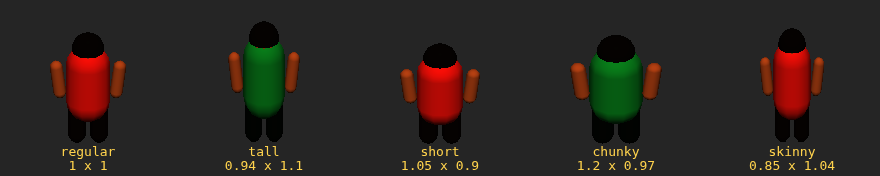

# Narco Futbol

Fast, server-authoritative 3D arcade football for the browser and for Discord.
Five minutes a match, five a side, power-ups, real physics, and bots that fill
every empty shirt so a game never waits for a full lobby. There is a tutorial,
four training drills, rebindable keyboard and gamepad controls, and it speaks
English and Spanish.

Everything on screen is built from primitives and canvas textures at runtime -
no models, no images, no audio files. Players can also be drawn from sprite
sheets, which are pre-rendered off those same models when you ask for them.


## Running it

```bash
npm install
npm run dev          # game server on :8080, client with HMR on :5173
```

Open http://localhost:5173. For a production-shaped run:

```bash
npm run build
npm start            # serves the built client and the WebSocket on :8080
```

Other scripts:

| Command | What it does |
| --- | --- |
| `npm test` | Simulation, shooting, controls, training and protocol tests |
| `npm run typecheck` | Type-checks client, server and shared code |
| `npx tsx scripts/balance.mjs 5 5` | Simulates 5 bot-only matches of 5 minutes and prints goals, shots, tackles, fouls |
| `npx tsx scripts/shots.mjs 5 3` | Classifies where every shot ended up: goal, save, block, wide |
| `SHOT_DIR=/tmp node scripts/smoke.mjs` | Boots the built game in headless Chromium and screenshots it |
| `SHOT_DIR=/tmp node scripts/multiplayer-smoke.mjs` | Two clients, opposite teams, one leaves mid-match |
| `SHOT_DIR=/tmp node scripts/training-smoke.mjs` | Settings, a rebind, a drill, the controls panel and the tutorial |
| `SHOT_DIR=/tmp node scripts/pad-smoke.mjs` | Plays the game with nothing but a (fake) gamepad: menus, kick-off, sprint |
| `SHOT_DIR=/tmp node scripts/sprite-smoke.mjs` | The same match drawn as models, as sprites far away, and as sprites throughout |
| `npm run sprites:bake` | Bakes the sprite sheets and writes them to `docs/sprites` |
| `npm run sprites:compare` | Shoots the model row and the sprite row for flicking between |
| `SHOT_DIR=/tmp node scripts/pitch-lines.mjs` | Renders the pitch markings on their own (needs `npm run dev:client`) |

## Controls

| | |
| --- | --- |
| `WASD` / arrows | Move |
| `Shift` | Sprint |
| `J` / left click | Pass — hold to charge a through ball |
| `K` / right click | Shoot — hold for more power and height |
| `L` | Lofted pass / cross |
| `Space` | Tackle — while sprinting it becomes a sliding tackle |
| `Q` | Switch to the team-mate best placed for the ball |
| `T` chat, `H` controls, `M` mute, `Esc` settings | |

Every one of those is rebindable. `Esc` (or **SETTINGS** on the front end)
opens the settings screen: language, player art, volume, and a table of every
action with three slots — a key, an alternative, and a gamepad button. Click a
slot, press whatever you want on any of the three devices, and it is saved to
`localStorage`. The same table is what `H` shows you mid-match, so the help
panel can never drift from your actual bindings.

## Gamepad

Anything the browser reports under the standard mapping. Out of the box: left
stick moves, right stick aims independently of it, d-pad also moves, A pass, B
shoot, Y lob, X tackle, RB sprint, LB switch player, Start settings, Back
controls. The stick is analog, so a nudge is a jog.

The pad drives the front end too, which means the game can be played from the
sofa without reaching for a keyboard: the d-pad walks whatever is on the visible
plate, left and right change a dropdown or a slider, A presses, B backs out. The
focus ring only appears once a pad is connected, so a mouse never sees it.

Pads that can rumble get a jolt for a goal, a challenge and being fouled. Every
button is rebindable in the same table as the keys, and the pad button is only
mentioned in the tutorial's prompts when a pad is actually plugged in.

You always attack left to right — the camera and the controls both flip for the
away side, so neither team plays in a mirror.

## How it fits together

```
shared/     the simulation and the wire format - identical on both ends
  sim/      ball flight, players, possession, tackles, rules, power-ups
  protocol  binary snapshots and input batches
server/     HTTP + WebSocket host, rooms, bot brains, training drills
client/     Three.js renderer, prediction, HUD, settings, i18n, audio
  input/    bindings, keyboard and mouse, gamepad
  render/   stadium, players, effects, the sprite baker and its billboards
  ui/       HUD, settings, tutorial, drills, faces, pad menu navigation
  bake.ts   offline sprite bake, run by scripts/bake-sprites.mjs
  compare.ts   the model-versus-sprite ruler, run by scripts/compare-sprites.mjs
```

`bake.html` and `compare.html` are development pages served by Vite. Neither is
an entry point of the production build, so nothing they pull in is shipped.

**The server is the only authority.** There is no host player. Every client
connects to the same dedicated process, sends nothing but its own input, and
receives the world back. Rooms are created on demand by name, so a link with
`?room=barrio` puts a group on their own pitch.

**A single simulation, run in two places.** `stepWorld()` is a pure function
over the world state at a fixed 60 Hz. The server runs it with everyone's
inputs. The client runs the exact same code to predict its own player, so your
movement, dribbling and shooting respond on the frame you press the key.

**Prediction with reconciliation.** Inputs carry a sequence number and are sent
in small redundant batches. Every snapshot acknowledges the last input the
server consumed; the client rewinds to that state, replays the inputs still in
flight, and folds the difference into a decaying offset rather than snapping.
Everyone else is drawn from an interpolation buffer about 110 ms in the past,
which is what makes remote players look smooth. The ball follows the same rule
with one exception: while it is at your feet it comes from the prediction.

**Bandwidth.** Snapshots are quantised to centimetres and packed into about
280 bytes for a 5v5 match, sent 20 times a second - roughly 5.5 KB/s per
client. Lobby traffic and chat stay on JSON text frames.

## Learning it: tutorial and training

**TUTORIAL** is a ten step lap through the controls — move, sprint, take a
touch, carry it, pass, cross, shoot, score, win it back, switch player. Each
step watches the match for the thing it asked for and ticks itself off when it
actually happens on the pitch, so there is nothing to click through. The cast
grows with the lesson: you start alone, a team-mate walks on when you need
somebody to pass to, and a marker joins for the tackle step.

**TRAINING** is four drills on a private pitch:

| | |
| --- | --- |
| **Free play** | An empty ground, a ball, and a keeper to beat |
| **Shooting** | The ball on a marked spot, a new angle every rep, scored out of attempts |
| **Dribbling** | Five gates to carry the ball through in order, against a defender, on the clock |
| **Passing** | A team-mate standing in a circle, and a count of how often you find him |

Both run on the ordinary simulation. A drill only sets up the situation — who
is on the pitch, where the ball starts, when a rep is over — so the physics,
the bots and the rules you practise against are the ones you play with. Solo
sessions get their own room and nobody else can join it.

## Bots and drop-in

Every shirt is always filled. Join and you take over a bot; leave and a bot
takes the shirt straight back, mid-match, without stopping play. Team sizes run
from 2 to 6 a side. The keeper is always automated - nobody wants to spend a
five minute game in goal.

Bots are not frame-perfect on purpose. They re-decide on a reaction timer, aim
with noise, hold buttons the way a human would, press and mark by role, and
only shoot when they have a sight of goal. Difficulty scales reaction time,
shooting range and how willing they are to commit to a tackle.

The keeper holds the angle, comes to sweep loose balls in the box, and dives at
what it can reach - but only after a reaction delay, which is what gives a well
placed shot somewhere to go.

## Football rules, arcade edition

- The touchlines are boards. No throw-ins, no corners, no offside.
- Sliding through a player instead of the ball is a foul and a free kick.
- Standing on the ball in a corner is not a tactic: if play does not move for
  seven seconds the referee restarts it with the other side on the ball.
- The referee runs a diagonal, blows for kick-off, goals, fouls and full time.
- Matches restart automatically, so a room keeps playing all evening.

## Power-ups

Crates drop onto the pitch and last twelve seconds:

| | |
| --- | --- |
| **Polvo Blanco** | Raw pace |
| **Polvora** | Shots leave scorch marks |
| **El Patron** | Nobody takes it off you |
| **Vision** | Passes find their man |

## Deploying

```bash
fly launch --no-deploy     # once
fly deploy
```

`fly.toml` keeps at least one machine up, because a match lives in that
machine's memory: rooms are not shared between machines, so let Fly's proxy pin
the WebSocket rather than load-balancing mid-game.

For Discord, see [DISCORD.md](DISCORD.md).

### GitHub Pages (client only, no server)

`.github/workflows/deploy-pages.yml` builds just the client
(`VITE_STATIC_ONLY=true npm run build:client`) and publishes it to GitHub
Pages on every push to `main`, or on demand from the Actions tab. There is no
WebSocket server on Pages, so that build disables online play, training and
the tutorial (shown in the menu, greyed out) and defaults the front end's
**Mode** selector to solo. Two offline modes still work fully, running the
same simulation the server runs, entirely in the tab:

- **Solo** - you against bots.
- **Local 2P** - two people on one device, same team, against bots. Player
  one keeps the usual keyboard/pad; player two gets a fixed key cluster
  (arrows to move, Enter/'/;/right-Shift//] for pass/shoot/lob/sprint/tackle)
  and, if a second gamepad is plugged in, that instead.

Enable Pages once under the repo's **Settings → Pages → Source: GitHub
Actions**. A normal `npm start` deployment (Fly or otherwise) keeps online
play, training and the tutorial available as before - the flag only affects
the static build.

## Tuning

Every number that matters is in `shared/constants.ts` — pitch size, ball drag
and Magnus curve, sprint speed, charge times, tackle ranges, power-up duration.
The two diagnostic scripts exist so a change can be judged rather than guessed:
`balance.mjs` reports the shape of a bot-only match, and `shots.mjs` says where
the shots went. The current defaults produce roughly 4 goals, 15 shots, 10
saves and 6 fouls per five minute bot match.

## Languages

English and Spanish, switchable at any time from the settings screen without a
reload. Static markup is tagged `data-i18n`; everything drawn at runtime asks
`t()` and re-renders on a language change. Server notices travel as a key plus
parameters so they arrive in the reader's language rather than the sender's.
Club names, the sponsors and the power-up names stay in Spanish in both — they
are flavour, not interface.

## Faces

Type a name and you get a face. It is generated from the name and nothing else,
so the same player is the same face on every screen in the room and not one byte
of it goes over the wire — everybody already knows everybody's name. The face
turns up beside the name field, on your own strip at the bottom of the HUD, in
front of every line of chat, and on the tag floating above each human player.

The drawing is [DiceBear](https://www.dicebear.com)'s *Personas* set by
Draftbit, used under CC BY 4.0 and credited on the front end. It is loaded on
demand rather than bundled, so the entry chunk does not carry it.

## Pre-rendered sprites

Age of Empires II and Diablo II drew their units by pointing a camera at a 3D
model, turning it a step at a time and keeping the pictures. **SETTINGS → Player
art** does the same to this game's players: *Models* is the 3D rig, *Sprites far
away* swaps in a billboard past 26 m, and *Sprites everywhere* uses them for
everyone.

Those two games could get away with one camera angle because theirs never moved.
This one cranes in and out and swaps ends, so the sheet needs a second axis — how
steeply the camera is looking *down* at the player:

```
column = which way they face, relative to the camera   (16 headings)
row    = animation frame, and within it, camera pitch  (19 frames x 3 pitches)
```

Only nine of the sixteen headings are actually drawn; the rest are the same
columns held up to a mirror, which is exactly the trick AoE2 used and which
halves the sheet. It is also why the key light sits square in front of the
camera rather than off to one side: a mirrored frame lit from the left would
turn into a frame lit from the right. The cost is that a pose which is not
left-right symmetric comes out the wrong way round on the mirrored half — the
kick swaps feet. `bakeAtlas({ mirrored: false })` pays double for the sheet and
makes that go away.

**Is it worth doing here?** Honestly: not for speed. Twelve players is nothing
to draw, and the crowd — the only thing on the pitch there is a lot of — is
already one instanced mesh. It earns its keep two other ways. It is a look:
sixteen headings means a player snaps between facings like a unit in an
isometric game rather than turning smoothly, and if that is the art direction
you want, this is how you get it. And it is the machinery for having many more
player variants than the renderer could otherwise afford, because a variant
costs a bake rather than a draw call.

**What it costs.** One sheet per kit, 576 x 3648, so about 8 MB of texture per
kit and 25 MB for the three kits in a normal match. That is why nothing is baked
until you switch the setting on; when you do, the bake happens on the GPU into a
render target and takes a fraction of a second. Nothing is downloaded — the
sheets are made on the machine that is going to draw them, which is also what
makes team colours free, since the shirt is simply baked in.

**Body variants.** Five builds — regular, tall, short, chunky, skinny — assigned
from the player's shirt number, so everyone sees the same man the same size.
They are deliberately only a scale on the figure's width and height, because a
non-uniform scale of a Y-rotated model projects to exactly the same non-uniform
scale on screen at every angle: one sheet covers all five, stretched. A variant
that changed the geometry — a different haircut, a bigger head — would need a
sheet of its own, which the baker takes as a parameter.

```bash
npm run sprites:bake      # writes docs/sprites/*.png and manifest.json
npm run sprites:compare   # the same players as models and as sprites
```

The sheets in `docs/sprites` are reference copies, not assets: nothing in the
build reads them. They are there to be looked at, and to be diffed when the
model changes. `compare-rig.png` and `compare-sprite.png` are the same eight
players in the same eight places, drawn each way — flick between them and
anything that moves is the sheet disagreeing with the model.



## Fiction

The clubs, the sponsors on the hoardings, the banners and the players are all
invented, and the setting is a cartoon of a 1980s South American league rather
than a depiction of anyone real.

## Later

The obvious next step for the sprite path is a palette mask: bake the shirt and
shorts to a channel of their own and tint them in the fragment shader, the way
AoE2's team colours worked. That would take the sheet count from one per kit to
one, and would let skin tones and hair vary without a bake each. Touch controls
for Discord on a phone are still missing, and are noted in
[DISCORD.md](DISCORD.md).
